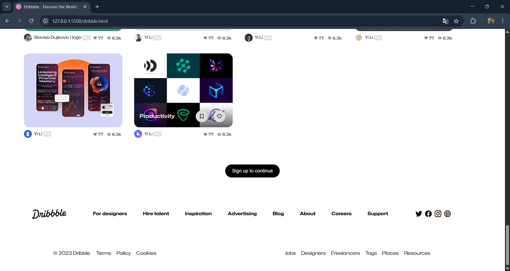
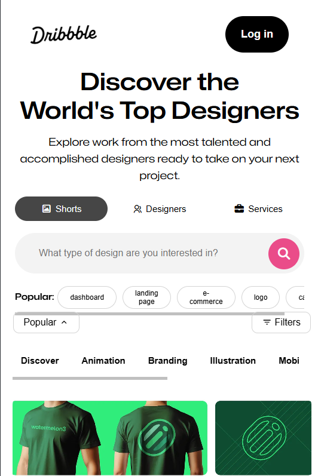
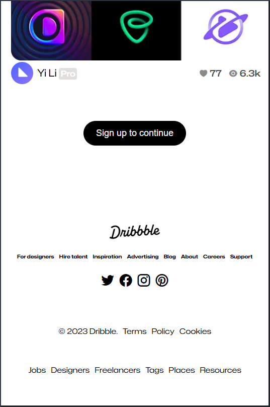

# 🎨 Dribbble Clone UI

A clean and fully responsive frontend clone of the **Dribbble** homepage — crafted with precision, style, and mobile-first responsiveness. This clone was made to sharpen frontend design skills and replicate a real-world layout without using any frameworks or JavaScript.

---

## 📸 Preview

### 💻 Desktop View  

### 📱 Mobile View  
  

---

## 🎯 Key Features

- Dribbble-style homepage layout
- Fully responsive across all screen sizes
- Clean, readable, and semantic HTML5
- CSS-only styling with Flexbox and Grid
- No frameworks or libraries used

---

## 🛠️ Built With

- HTML5  
- CSS3  
- Pure design thinking 🎨

---

## 📬 Feedback

If you have any suggestions, improvements, or feedback — feel free to reach out!

📧 pawankushwaha91719171@gmail.com  
🔗 [LinkedIn](https://www.linkedin.com/in/pawan-kushwaha-485942326/)  

---

## 👤 Author

**Pawan Kushwaha**  
🧑‍🎓 B.Tech (AI & ML) | Frontend Developer | Graphic Designer

---

## 📄 License

This project is licensed under the **MIT License** — free to use and modify.

---

